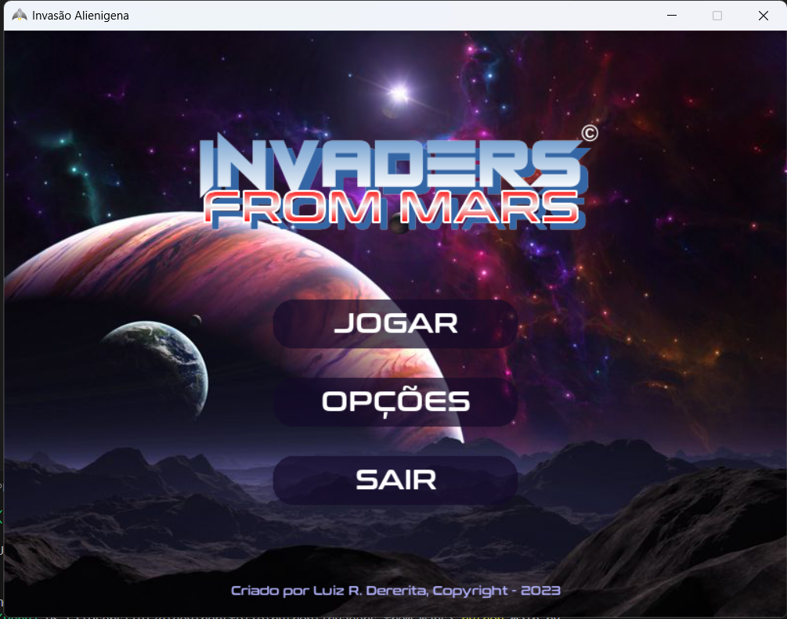
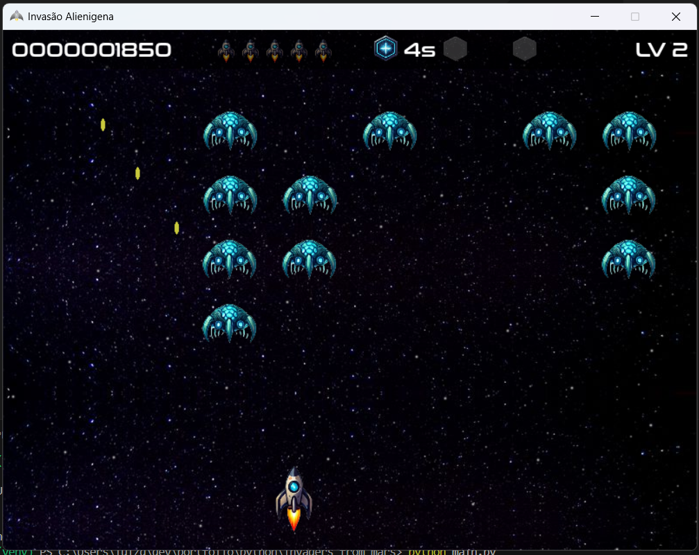

# 👾 Invaders From Mars

**Invaders From Mars** é um jogo 2D em desenvolvimento com **Python** e **Pygame**, inspirado no projeto proposto no livro _"Curso Intensivo de Python"_ de **Eric Matthes**. Este projeto foi inicialmente baseado no jogo “Alien Invasion” sugerido pelo autor, mas passou por diversas melhorias gráficas, estruturais e de jogabilidade para se tornar algo mais robusto e original.

---

## 🎮 Sobre o Jogo

O jogador assume o controle de uma nave espacial em uma missão para defender a Terra de uma invasão alienígena vinda de Marte. Com mecânicas simples de movimentação e tiro, o jogo se desenrola em ondas progressivamente mais desafiadoras, com power-ups e efeitos visuais que enriquecem a experiência.

---

## ✨ Melhorias em relação ao projeto original

Este projeto busca **ir além** da proposta original do livro de Eric Matthes:

- ✅ **Sistema de Estados (Splash → Menu → Gameplay)** com transições suaves.
- ✅ **Power-ups visuais e funcionais**: velocidade, escudo e tiro duplo.
- ✅ **Sistema de HUD com relógio, contadores e botões interativos.**
- ✅ **Efeitos visuais** avançados: spawn dos inimigos, animações de fundo e transições de texto.
- ✅ **Gerenciador de áudio centralizado** com sons de clique, hover, power-ups etc.
- ✅ **Arquitetura modular e escalável**, com separação clara de responsabilidades (estados, gráficos, assets, utilitários).

---

## 🧠 Arquitetura do Projeto

O jogo segue um padrão **modular e extensível**, com inspiração em **MVC** e aplicação do **State Pattern**. A organização dos arquivos é a seguinte:

```
invaders_from_mars/
├── assets/           # Sons, sprites, imagens
├── core/             # Estados principais do jogo (Menu, Splash, Fase, etc.)
├── graphics/         # Gerenciamento gráfico e HUD
├── utils/            # Áudio, transições, efeitos visuais
├── main.py           # Ponto de entrada do jogo
├── requirements.txt  # Dependências do projeto
```

---

## 📌 Estado Atual do Projeto

| Item                          | Status       | Observações                                                                 |
|-------------------------------|--------------|------------------------------------------------------------------------------|
| Tela Splash                   | ✅ Completa   | Fade-in/out suave com exibição do logo da produtora                         |
| Menu Principal                | 🔶 Parcial    | Apenas o botão **"Jogar"** está funcional. Os botões "Continue", "Settings" e "Quit" ainda não têm ação atribuída |
| Gameplay                      | ✅ Funcional  | Mecânica de tiro, movimentação e power-ups implementada                     |
| Sistema de HUD                | ✅ Completo   | Exibe relógio, dinheiro, botões laterais, etc.                              |
| Sistema de Fases              | 🔶 Inicial    | Sistema de ondas com transições parciais; melhorias em andamento            |
| Tela de Game Over             | 🔴 Rudimentar | Funcionalidade básica, mas com layout e comportamento ainda provisórios     |
| Sistema de Som                | ✅ Integrado  | Efeitos sonoros para interações e eventos                                   |

---

## 🚧 Futuras Implementações

- [ ] Finalização dos botões do Menu Principal
- [ ] Sistema de fases com progressão mais elaborada
- [ ] Tela de Game Over aprimorada com animações e estatísticas
- [ ] Salvamento de progresso (opcional)
- [ ] Sistema de pontuação e leaderboard
- [ ] Melhorias de performance e responsividade

---

## 🛠️ Requisitos

- Python 3.8+
- Pygame (instalável via `pip install pygame`)
- Outros requisitos estão listados em `requirements.txt`

---

## 🧪 Como Executar

```bash
# Clone o repositório
git clone https://github.com/seu-usuario/invaders_from_mars.git

# Entre na pasta do projeto
cd invaders_from_mars

# (Opcional) Ative seu ambiente virtual
python -m venv venv
source venv/bin/activate  # ou .\venv\Scripts\activate no Windows

# Instale as dependências
pip install -r requirements.txt

# Execute o jogo
python main.py
```

---

## 📚 Créditos

- Inspirado por: **Alien Invasion** do livro _Curso Intensivo de Python_, de **Eric Matthes**
- Desenvolvido e aprimorado por: **Luiz Ricardo Dererita de Araújo**
- Ferramentas: **Python**, **Pygame**

---

## 🪐 Licença

Este projeto está sob a licença MIT. Sinta-se livre para estudar, adaptar, contribuir e compartilhar!

---

## 🌌 Capturas de Tela (em breve)

<!-- Adicione aqui imagens do gameplay, menu, efeitos visuais, etc. -->


> Tela do Menu Principal do jogo.



> Gameplay do jogo.

---

**Siga o progresso, contribua ou apenas jogue!**
